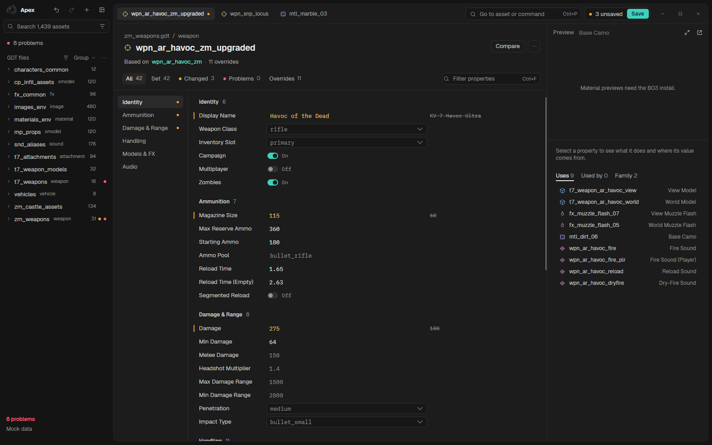
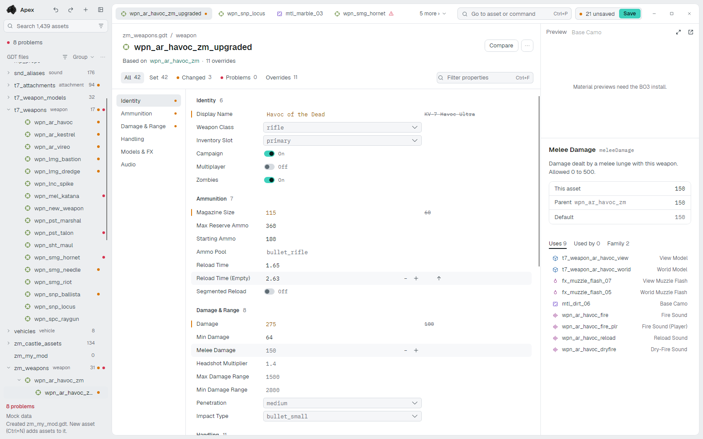
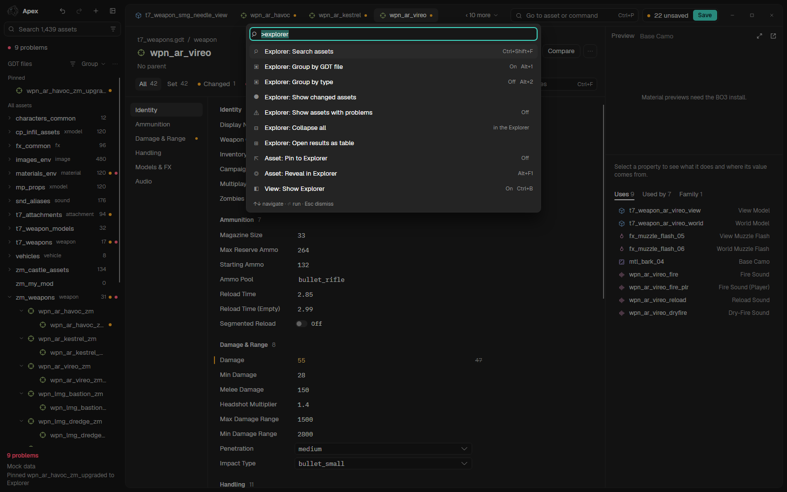
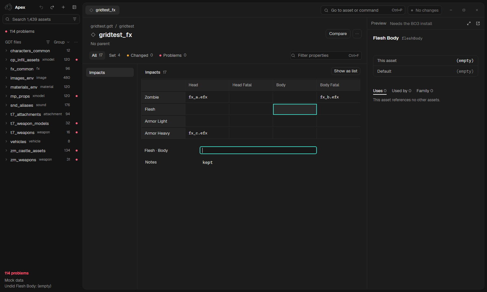

<p align="center">
  
</p>

<h1 align="center">Apex</h1>

Apex replaces Treyarch's Asset Property Editor (APE) for Black Ops III. It edits the same GDTs with the same
deffiles, shows the same renderer's preview, and is quicker and calmer to work in: one window, a keyboard shortcut
for the things you do daily, and your unsaved work kept safe if anything goes wrong.

It installs into the Mod Tools' `bin` folder, either in place of APE (APE is kept, and uninstalling puts it back) or
beside it as `Apex.exe`, which [Blackbird](https://github.com/Blakintosh/blackbird) opens.

> **Apex is in preview.** It does most of what APE does, but not all of it yet (see [Known gaps](#known-gaps)), and
> it will have bugs. Please [report them](https://github.com/Blakintosh/apex/issues): [how](#crashes-and-bug-reports).

<p align="center">
  
</p>

<p align="center">
  
  
</p>

<p align="center">
  
</p>

<p align="center"><sub>The screenshots show Apex's sample data, made-up assets with no game files behind them: the dark and light themes, the palette, and a section shown as a grid.</sub></p>


## What it does

- Opens any asset by name with **Ctrl+P**, or by filters such as `type:weapon prop:damage>=100`. Type `>` for
  commands and `@` for a property of the open asset.
- Edits the same GDTs APE does, through the same deffiles, and saves them only when you ask (**Ctrl+S**). Before a GDT
  is overwritten Apex keeps a copy of the old one, and it asks rather than overwriting a file that changed on disk
  since it loaded.
- Keeps your work through a crash or restart: unsaved changes are on disk until you save or discard them.
- Shows what an asset inherits and what it overrides, what changed this session and what has problems, each as a view
  of the form. **Set** lists only the properties an asset holds a value for, with **Add property** to bring in another.
- Shows a section whose keys are a grid of two names (an entity's impact effects by surface and hit type, say) as the
  grid it is, with a switch back to the list.
- Lines assets up side by side with **Compare** (Ctrl+D), and edits many at once by opening search results as a table.
- Shows what references an asset and what it references, in the Inspector, and follows a reference with **F12**.
- Previews models, materials and xanims, with notetracks, through APE's own renderer, so they look the same.
- Follows the Windows light or dark setting, with three fixed themes (Graphite, Slate and Light) if you'd rather pick.
- Takes extensions, which add fields, tables and sections to the asset types it edits: see [Extensions](#extensions).

## Requirements

- Windows 10 or 11, 64-bit.
- Call of Duty: Black Ops III with the mod tools installed.

The release carries its own .NET runtime. For texture conversion Apex uses the Visual C++ 2012 runtime, which Steam
installs with Black Ops III (`_CommonRedist\vcredist\2012` in the game folder). Without it Apex still works, but
textures it converts can differ very slightly from APE's.

## Installing

Download `apex-setup.exe` from the Releases page and choose Install. It puts Apex into the game's `bin` folder, either
in place of APE (APE is kept) or beside it as `bin\Apex.exe`. To install by hand, unzip `apex-<version>-win-x64.zip`
into the `Call of Duty Black Ops III` folder.

Apex finds the install through Steam. If it can't, it says so and offers **Locate…**: pick the
`Call of Duty Black Ops III` folder (the one holding `deffiles` and `source_data`). Apex remembers that folder.

Apex updates itself: when a release is out it downloads it in the background and offers to install it, now or when
you close Apex. **Updates** in the Apex menu (the mark, top left) checks straight away.

## Uninstalling

Open the installer and choose Uninstall. If Apex replaced APE, this puts APE back; either way it removes what it added.

Apex's own files are in `%AppData%\Apex` (settings and extensions) and `%LocalAppData%\Apex` (backups, the session,
logs). Delete those folders to remove them.

## Keyboard shortcuts

| Shortcut | Action |
| --- | --- |
| Ctrl+P | Go to an asset, or `>` for commands, `@` for a property |
| Ctrl+Shift+P | Show all commands |
| Ctrl+E | Recent assets |
| Ctrl+N / Ctrl+Shift+N | New asset / new GDT |
| Ctrl+S | Save all |
| Ctrl+Z / Ctrl+Y | Undo / redo |
| Ctrl+F | Filter the open asset's properties |
| Ctrl+Shift+F | Search assets |
| Ctrl+D | Compare |
| F12 | Go to a reference |
| F2 | Rename |
| Alt+Left / Alt+Right | Back / forward (the mouse's side buttons do too) |
| Ctrl+T / Ctrl+W / Ctrl+Tab | New tab / close tab / next tab |
| Ctrl+B / Ctrl+Shift+B | Show or hide the Explorer / the Inspector |
| F6 | Move to the next pane |

## Extensions

An extension is a folder in `%AppData%\Apex\extensions` that adds fields, tables and sections to asset types Apex
already edits, such as a weapon's recoil settings. Apex ships none. Their values are kept in a `<name>.gdtx` file
beside each GDT, because APE drops keys its deffiles don't declare. An extension may also bring one native module that
moves the weapon preview (kick, springs, the spray overlay). Apex asks in the preview before it loads one, since it runs
with your permissions; say Load only if you trust where the extension came from. Writing one:
[docs/extensions.md](docs/extensions.md).

## Saving

Nothing is written to a GDT until you save (**Ctrl+S**). Before Apex overwrites a GDT (or its `.gdtx`) it keeps a copy
of the old one in `%LocalAppData%\Apex\backups` (the last 10 per file). To go back, use **Restore previous version of
this GDT** from the command palette. If a GDT changed on disk since Apex loaded it, saving asks what to do rather than overwriting it.

Unsaved changes are kept in `%LocalAppData%\Apex\session` until you save or discard them.

## Crashes and bug reports

If something goes wrong, Apex writes a log to `%LocalAppData%\Apex\logs` and keeps your changes.

Report bugs at <https://github.com/Blakintosh/apex/issues>. Say what you did, what you expected and what happened,
and attach the newest log from that folder. The asset name and its GDT help too.

## Known gaps

These work in APE but not in Apex yet:

- Image composites are not supported.
- Warning labels the deffiles add, such as INVALID MATERIAL TYPE, are not shown.
- There is no Undelete.
- There is no Reset to deffile default for a field.
- The preview has no LOD switch.
- File fields have no Open, Show in Explorer or Copy path.
- Table mode shows the schema default for fields a derived asset inherits, not its parent's value.
- Rows a deffile button creates outside the schema appear only after you reopen the asset.
- Fields that a material type change adds appear under "Material" until you reopen the asset.

## Building from source

You need the .NET 10 SDK.

```
dotnet build Apex.slnx -c Release
.\release.ps1 -AllowDirty
```

`release.ps1` builds the single-file `Apex.exe`, the bundle and `apex-setup.exe` into `artifacts\`; the setup is built
from gscode-installer, checked out beside this repo (`-Installer` says where).

`Apex.Shots` drives the whole app headlessly over sample data, with real keyboard and mouse input, and writes
screenshots of what it checks. It never touches your install or your GDTs:

```
dotnet run -c Release --project Apex.Shots -- --fast
```

Screenshots land in `Apex.Shots/shots/`. `docs/testing.md` says which checks belong in which tier.

## Licence

Apex is free software under the [GNU General Public License, version 3](LICENSE): you may use, change and share it,
and what you share has to stay under the same licence, with its source.

It includes work that is not covered by it: `ThirdParty/CallOfFile` (MIT, in its folder), the Geist and IBM Plex Mono
fonts (SIL Open Font License; the licence texts sit beside them in `Apex.Editor/Assets/Fonts`), and the NuGet
packages listed in the projects, each under its own licence (Avalonia, CommunityToolkit.Mvvm, NAudio, Vortice and
LZ4 are MIT; ImageSharp is used under the Six Labors Split License, as an open source work). No Treyarch shaders, bytecode or
textures are in this repository: Apex reads them from your own game folder at run time.

Apex is not made by or affiliated with Treyarch or Activision. Call of Duty and Black Ops are their trademarks.
